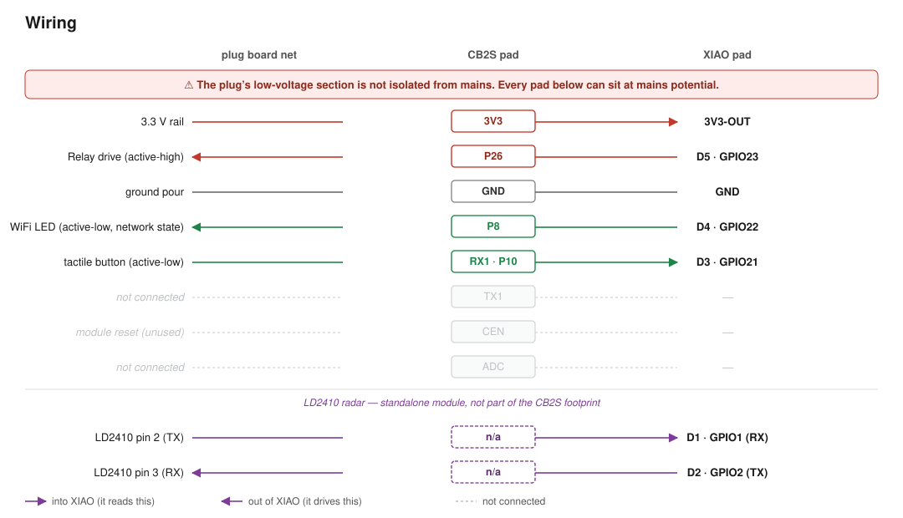

# CB2S Smart Plug — Matter Conversion (switch + occupancy radar)

Converting a Tuya smart plug — built around a **CB2S** module (Beken
**BK7231N**, Cortex-M4F @ 120 MHz, 256 KB SRAM, 2 MB SPI flash) — into a
Matter-controlled plug: the stock module is replaced with a **Seeed Studio
XIAO ESP32-C6**, driving the plug's relay and button over **Matter over
Thread**, plus an **HLK-LD2410 24 GHz presence radar** flying-wired in as a
second, independent Matter **Occupancy Sensor** endpoint.

This plug is a plain switch — no energy metering. `tuya-config.json` (the
stock firmware's own dumped config) and `info.txt` agree: there is no
`ele_pin`, `vi_pin`, `sel_pin_pin`, `ele_fun_en`, or `resistor` key, and no
BL0937 pin roles anywhere in the dump. The freed GPIOs that a metering
front end would have used are what the radar's UART pair takes instead.

This repo carries both halves of the conversion:

- **Reverse-engineering notes** (below, and `docs/`) — the measured hardware
  mapping recovered from the stock device, which the new firmware and wiring
  depend on.
- **The replacement firmware** (`main/`, ESP-IDF + esp_matter) — see
  [CLAUDE.md](CLAUDE.md) for its architecture and build instructions, and the
  [Wiring](#wiring--replacing-the-cb2s-with-a-xiao-esp32-c6) section below for
  how the XIAO and radar are wired in.

---

## Device summary

| Property | Value |
|---|---|
| Module | CB2S (BK7231N) |
| Channels | 1 relay |
| Energy metering | None |
| Occupancy | HLK-LD2410 24 GHz radar (not part of the original plug) |

---

## Measured pinout

This is the measured hardware wiring, recovered from `tuya-config.json` (the
stock firmware's own dumped config) and `info.txt`, and should be treated as
the authoritative mapping:

| Signal | Measured pin | Polarity |
|---|---|---|
| Button | **P10** (`RX1`) | active-low (`bt1_lv:0`) |
| WiFi LED | **P8** | active-low (`netled1_lv:0`) |
| Relay | **P26** | active-high (`rl1_lv:1`) |

---

## Wiring — replacing the CB2S with a XIAO ESP32-C6, plus the radar

The CB2S module is desoldered and a **Seeed Studio XIAO ESP32-C6** is wired
into the pads it vacated, becoming the plug's new brain over Matter/Thread.
An LD2410 radar module is separately flying-wired in for occupancy — it is
not part of the original CB2S footprint at all. See [CLAUDE.md](CLAUDE.md)
for the firmware's build/flash workflow.

> **⚠️ Mains safety.** This plug's low-voltage section is **not isolated from
> mains** — the relay drive sits close to mains potential, so pads on the
> CB2S footprint can be live. Never connect USB to the XIAO while the plug is
> connected to mains, and never probe or rework the board while it is plugged
> in. Use an isolation transformer for any bring-up that needs mains present,
> and discharge the bulk capacitor before handling the board.

**Not a drop-in.** The CB2S module is ≈15 × 18 mm with a single row of
castellated pads along one edge; the XIAO ESP32-C6 is ≈21 × 17.5 mm with two
2.54 mm headers on opposite long edges, plus a USB-C connector and antenna
that need clearance. This is a flying-wire rework — the CB2S is desoldered,
the XIAO is mounted wherever it fits inside the enclosure, and each signal is
run as an individual wire from the vacated footprint pad to the corresponding
XIAO pad. Check clearance to mains-carrying copper before fixing the XIAO in
place.

**Power.** The plug's 3.3 V rail feeds the XIAO's **3V3** pad, back-feeding
the XIAO's own regulator output. Do **not** use the XIAO's 5V/VBUS pad for
this — that pad is the *input* to the XIAO's onboard LDO, and 3.3 V there
sits below the regulator's dropout voltage, so the board will brown out or
run marginally.

**The `RX1` pad carries the button, not a UART line.** The measured pinout
above puts the button on **P10**; on this module, P10 is the internal BK7231N
pin brought out to the pad silkscreened `RX1` (confirmed against the plug's
schematic) — a naming leftover from the module's UART1, not an indication
that anything UART-related is wired there.

### Pin assignment — plug

Three signals, plus power and ground, land on real, reachable footprint
pads — no PCB rework needed:

| Plug net | CB2S pad | Direction (XIAO's view) | XIAO pad | GPIO |
|---|---|---|---|---|
| Button | `RX1` (= P10) | in — pull-up, edge | **D3** | GPIO21 |
| WiFi LED (repurposed as network LED) | `P8` | out | **D4** | GPIO22 |
| Relay | `P26` | out | **D5** | GPIO23 |
| 3.3 V rail | `3V3` | power in | **3V3** | — |
| Ground | `GND` | ↔ | **GND** | — |
| — | `CEN`, `ADC`, `TX1` | — | *not connected* | — |

XIAO-side pin choices are ours, since the two boards are joined by hand
rather than sharing a connector. Constraints applied:

- **D6/D7 (GPIO16/17) are deliberately left unused** — these are the
  ESP32-C6's default console UART0 pins. Wiring a signal there crash-loops
  the console the moment the peripheral driver also claims them.
- None of D0–D10 are ESP32-C6 strapping pins (GPIO4/5/8/9/15, which sit on
  the XIAO's MTMS/MTDI/Boot/Light pads — none used by this design), so none
  of the choices above affect boot behaviour.
- D0–D2 are free (the plug has no metering front end to occupy them), which
  is what leaves room for the radar's UART pair below.



### Pin assignment — LD2410 radar

Not on the CB2S footprint at all — a separate flying-wire connection to a
standalone LD2410 module:

| LD2410 pin | Signal | XIAO pad | GPIO |
|---|---|---|---|
| 2 (TX) | → ESP **RX** | **D1** | GPIO1 |
| 3 (RX) | ← ESP **TX** | **D2** | GPIO2 |
| 4 | GND | GND | — |
| 5 | VCC (5V or 3V3-OUT) | 5V | — |
| 1 (OUT) | *not used* — presence comes over UART, not this pin | — | — |

Crossed, not same-name-to-same-name: sensor TX wires to the board's RX pin
and vice versa. UART1, 256000 baud 8N1 — the sensor's factory defaults; this
firmware issues no sensor-side configuration at all. See
[docs/ld2410_wiring.md](docs/ld2410_wiring.md) for the full wiring reference
this was adapted from.

### Bench verification checklist

- [ ] Continuity-check all footprint pads to their nets **before**
      desoldering the CB2S — the pad↔net mapping above is inferred from the
      measured *pin* map, not probed at the *pad* itself.
- [ ] Confirm `CEN` and `ADC` are genuinely unused on this PCB (`CEN` is
      likely pulled high; check whether anything else rides that net).
- [ ] Confirm the relay is **de-energised through XIAO boot** — check the
      pad's state across reset *before* wiring it to a live load.
- [ ] Confirm the plug's LED lights when GPIO22 is driven low, matching the
      `netled1_lv:0` polarity recovered from `tuya-config.json`.
- [ ] Verify physical fit and clearance from mains-carrying copper and from
      the relay to both the XIAO's antenna and the radar module.
- [ ] Confirm the radar's TX/RX are crossed correctly — swapped wiring means
      no frames ever parse, and `radar_bridge_init()` logs a warning but the
      firmware otherwise boots normally, so this is easy to miss.

---

## Flash layout (stock CB2S module, for reference)

| Region | Contents |
|---|---|
| `0x000000`–`0x110000` | Application image |
| `0x110000`–`0x1D0000` | Erased (`0xFF`) |
| `0x1D1000` | Configuration block — WiFi creds, MQTT, pin roles |
| `0x1D2000` | Device key/value store (`log_seq_stat`, `RLY_STAT`, …) |
| `0x1EE000` | Tuya config region (stock layout, per `info.txt`) |

Stock Tuya BK7231N app images are stored **XOR-encrypted** in flash; the config
regions near `0x1D0000` are plaintext.

---

## Datapoints declared by the original Tuya schema

Retained for reference, as it documents what the stock hardware reports.
No energy-metering DPs are present — consistent with `tuya-config.json`
carrying no BL0937 pin roles:

| DP | Type | Meaning |
|---|---|---|
| 1  | bool | Switch |
| 9  | value | Countdown (0–86400 s) |
| 38 | enum | Power-on state — `off` / `on` / `memory` |
| 40 | enum | Indicator mode — `relay` / `pos` / `none` / `on` |
| 41 | bool | Child lock |

---

## Matter commissioning identity — changing the pairing code

Each flashed device's QR payload / manual pairing code is derived entirely
from three values in `main/chip_project_config.h`:

- `CHIP_DEVICE_CONFIG_USE_TEST_SETUP_DISCRIMINATOR` — a 12-bit value
  (`0x000`–`0xFFF`) advertised in commissionable-node discovery so a
  controller can tell devices apart before pairing. Must be unique among
  devices being commissioned at the same time.
- `CHIP_DEVICE_CONFIG_USE_TEST_SETUP_PIN_CODE` — the setup passcode
  (1–99999998), excluding the trivial values the Matter spec forbids (e.g.
  `00000000`, `11111111`, `12345678`). This is the plaintext number printed
  on the manual pairing code and encoded in the QR payload.
- `CHIP_DEVICE_CONFIG_USE_TEST_SPAKE2P_VERIFIER` — a base64 SPAKE2+
  verifier. The CHIP stack authenticates a commissioner's PAKE exchange
  against *this* verifier, never against the plaintext passcode above — the
  passcode is only for humans/QR codes. The two are cryptographically
  linked: change the passcode and the verifier must be regenerated to
  match, or commissioning fails (silently — the device just never completes
  PASE, no informative error).

This build's discriminator/passcode (`0x824` / `31415926`) are deliberately
different from both sibling projects — `esp32h2-matter-plug`
(`0x822`/`29312364`) and `esp-demo-matter` (`0x820`/`20250816`) — so all
three can be commissioned onto the same Thread fabric at once.

### To change it

1. Pick a new discriminator (any `0x000`–`0xFFF`, must differ from any
   other device you'll commission concurrently).
2. Pick a new passcode (1–99999998, not one of the spec's forbidden trivial
   values) and regenerate the matching verifier:

   ```sh
   python3 tools/spake2p_verifier.py <passcode>
   ```

   This script reimplements the CHIP SDK's `Spake2pVerifier::Generate()`: it
   runs PBKDF2-HMAC-SHA256 over the passcode (using the same default
   salt/iteration-count the SDK's test verifier uses) to derive `w0`/`w1`,
   reduces both mod the NIST P-256 group order, derives `L = w1 * G` on
   P-256, and prints `base64(w0 || L)` — the verifier blob CHIP expects. It
   self-checks against a known vector (passcode `20202021`) before printing
   your result, so a broken `cryptography` install fails loudly rather than
   silently emitting a bad verifier.
3. Edit `main/chip_project_config.h` and update all three defines together
   — discriminator, pin code, and the freshly generated verifier. The
   passcode and verifier **must** be kept in sync; a stale verifier for a
   changed passcode bricks commissioning without any error pointing at the
   cause.
4. Rebuild and reflash:

   ```sh
   idf.py build
   idf.py flash monitor
   ```

   The new QR payload / manual code is printed on boot (`matter_setup: Matter
   manual code: …` / `matter_setup: Matter QR payload : …`) once the
   commissioning window opens.

If a device was already commissioned onto a fabric before you change these
values, changing them does not un-commission it — the fabric binding lives
in NVS, separate from the setup passcode/discriminator. Factory-reset the
device (or erase its NVS) if you need it to forget its old fabric before
re-commissioning with the new code.

---

## References

- [LibreTiny — Beken BK72xx](https://docs.libretiny.eu/docs/platform/beken-72xx/)
- [BK7231 datasheet / pinout / programming](https://www.elektroda.com/news/news3951016.html)
- [tuya-iotos-embeded-sdk-wifi-ble-bk7231n](https://github.com/tuya/tuya-iotos-embeded-sdk-wifi-ble-bk7231n)
