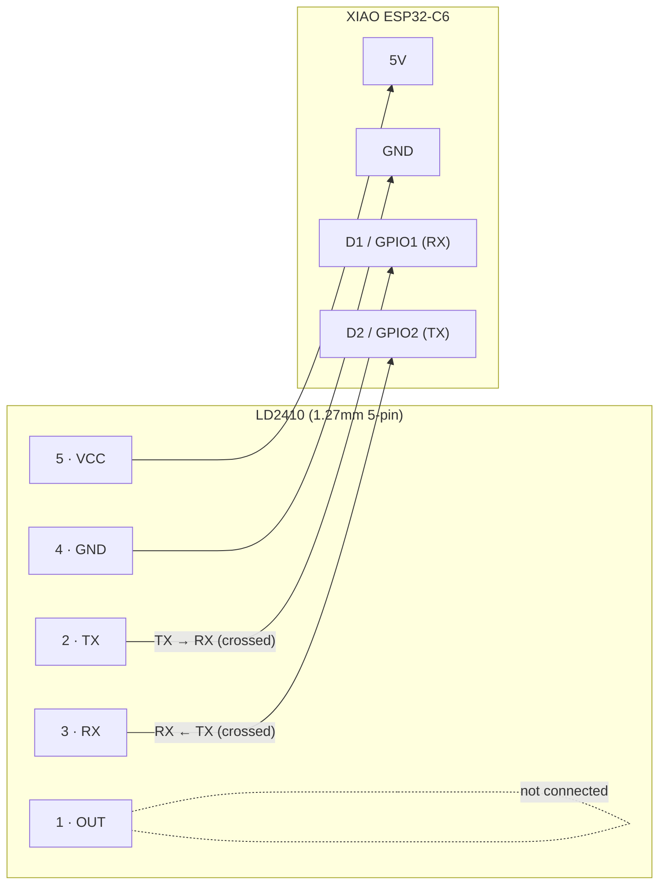

# LD2410 wiring

Sensor connector is a 1.27mm 5-pin header. Board pinout is the Seeed XIAO
ESP32-C6's `D0`–`D10` headers (see `seed xiao pinout.png`). This plug has no
energy metering, so D0–D2 are otherwise unused — the radar's UART pair lives
there. D6/D7 look tempting (adjacent, UART-capable) but are this board's
console UART0 pins — wiring the radar there crash-loops the boot (see
`board_pins.h`).

**Crossed, not same-name-to-same-name**: sensor TX (pin 2) wires to the
board's RX pin (D1); sensor RX (pin 3) wires to the board's TX pin (D2).
This is normal for UART — each side's TX drives the other side's RX.

| Sensor pin | Signal | XIAO pin | GPIO | Note |
|---|---|---|---|---|
| 1 | OUT | — | — | not used; UART carries presence instead |
| 2 | TX | D1 (`RADAR_UART_RX`) | GPIO1 | 3.3 V logic, no level shifter needed |
| 3 | RX | D2 (`RADAR_UART_TX`) | GPIO2 | |
| 4 | GND | GND | — | common ground required |
| 5 | VCC | 5V (or 3V3-OUT) | — | module regulates internally |

256000 baud, 8N1 (the sensor label's "2560001 stop bit" is an OCR artifact —
this is the standard LD2410 default). No sensor-side configuration is issued
at all; the module runs on factory defaults, and the ESP only listens.
